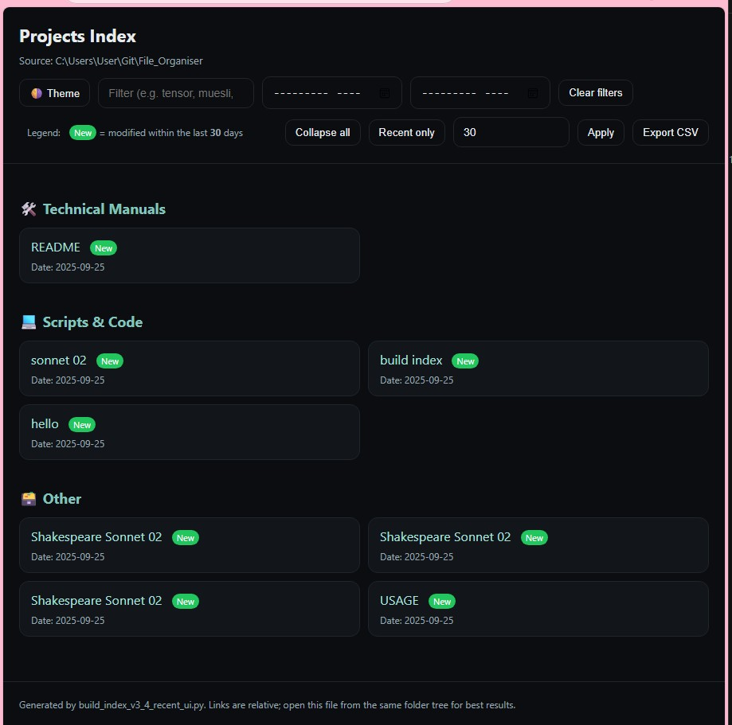

# 📚 Projects Index Generator

A Python tool to **auto-generate an index** of your files (PDF, Markdown, text, scripts) as a clean **HTML dashboard** and **Markdown list**.

---

## ✨ Features

- 🌗 **Light/Dark theme toggle** (remembers your choice)
- 🔍 **Search box** (live filter by title, date, category)
- 📅 **Date range filters** (`From` / `To`)
- 📂 **Per-section collapse memory** (remembers which sections you left open)
- 🆕 **Recently Added badges** (files modified within X days)
- ⚙️ **Adjustable “Recent days” window** (set in the UI, saved to localStorage)
- ⬇️ **Export CSV** (respects current filters, includes category, extension, and recency)

---

## 🚀 Quick Start

1. Clone this repo:
   ```bash
   git clone https://github.com/your-username/projects-index.git
   cd projects-index
   ```

2. Run the script on your library folder:
   ```bash0
   python scripts/build_index.py ~/Documents
   ```

3. Open the generated files:
   - `Projects_Index.html` → interactive dashboard
   - `PROJECTS_INDEX_AUTO.md` → Markdown index

---

## 📂 Repo Layout

```
projects-index/
├── scripts/                # Python scripts (latest + archived versions)
├── examples/               # Example outputs (HTML + MD)
├── docs/                   # Usage guide, changelog
└── chat_notes/             # Saved ChatGPT sessions and design notes
```

---

## 🎛️ Usage Guide

### Requirements
- Python **3.8+**
- No external libraries required (pure standard library)

### Running the Script

Basic usage (current folder, both HTML + Markdown outputs):
```bash
python scripts/build_index.py
```

Index a specific folder:
```bash
python scripts/build_index.py ~/Documents
```

Recursive mode (include subfolders):
```bash
python scripts/build_index.py ~/Documents --recursive
```

HTML only:
```bash
python scripts/build_index.py --format html
```

Markdown only:
```bash
python scripts/build_index.py --format md
```

Custom output filenames:
```bash
python scripts/build_index.py ~/Library   --out-html index.html --out-md INDEX.md
```

---

## 🖥️ Interactive Dashboard Features

- **Search box** → type any keyword (title, date, category) to filter  
- **Date range filters** → limit items between `From` and `To` months  
- **Recent only toggle** → show only items with the 🆕 **New** badge  
- **Recent days input** → adjust the recency window (default: 7 days), persists via browser localStorage  
- **Collapse/Expand sections** → click headers or use the “Collapse all” button (state remembered across sessions)  
- **Export CSV** → saves a filtered CSV with Category, Title, Path, Date, Extension, and Recent status  

---

## ⚙️ Script Configuration

At the top of the Python script you can adjust:

- **`EXTENSIONS`** → file types to include (`.pdf`, `.md`, `.txt`, `.py`, `.bat`, `.ps1`…)  
- **`CATEGORY_RULES`** → dictionary of keywords to group files into categories  
- **`RECENT_DAYS`** → default recency threshold (overridden by the UI)  

---

## 🧩 Tips & Best Practices

- Keep the HTML file in the same folder tree as your indexed files → ensures relative links open correctly.  
- Use `git` to track script changes and `docs/CHANGELOG.md` to log new features.  
- Add screenshots of your generated dashboard to `examples/` for quick previews.  
- Export CSV regularly if you want a lightweight table of your indexed library.  

---

## 🖼️ Screenshot

Here’s what the HTML dashboard looks like:



---

## 📜 License

MIT License. Free to use, modify, and share.
